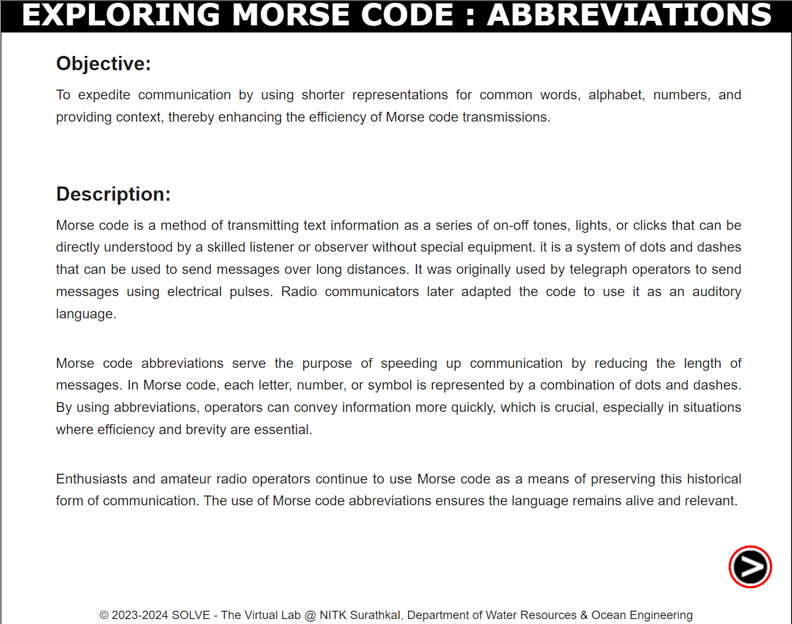
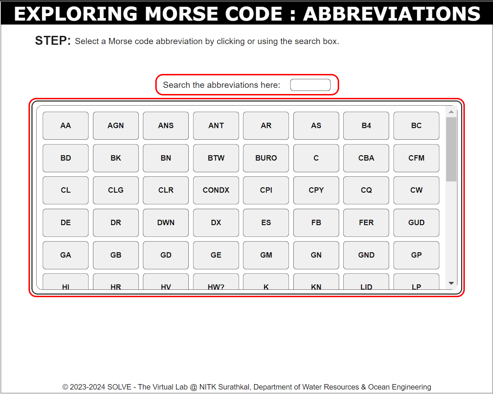

### These procedure steps will be followed on the simulator  
1. Open the Abbreviations simulation and go through the Objective and Description, then click the 'NEXT' button in the bottom right corner.

2. Use the input box to search for abbreviations, or select an abbreviation directly from the table.

3. Once an abbreviation is selected, its meaning will be displayed. To generate the Morse code for the selected abbreviation, click the "Play" button then click the "Back" button. To try different abbreviations by re-entering new ones and selecting them from the table. 

